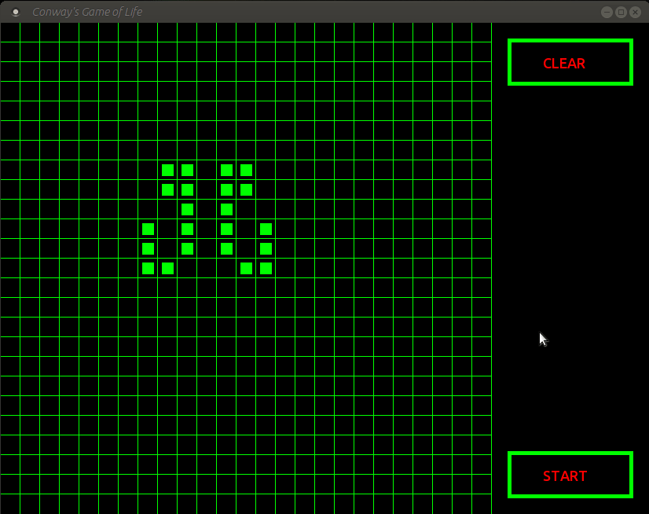

### Conway's Game of Life  
  
***  
  
#### My implementation of the Game of Life cellular automaton:  
  
  
  
***  
  
#### To read more about the Game of Life:  
https://en.wikipedia.org/wiki/Conway%27s_Game_of_Life  
  
#### How to run:  
Clone the repository:  
  
```
git clone git@github.com:otratsiuk/Conway-s-Game-of-Life.git  
```
  
Compile and run:  

```
cd Conway-s-Game-of-Life  
g++ game_of_life.cpp -c -o life  
g++ life -o life-app -lsfml-graphics -lsfml-window -lsfml-system  
./life-app  
```


 